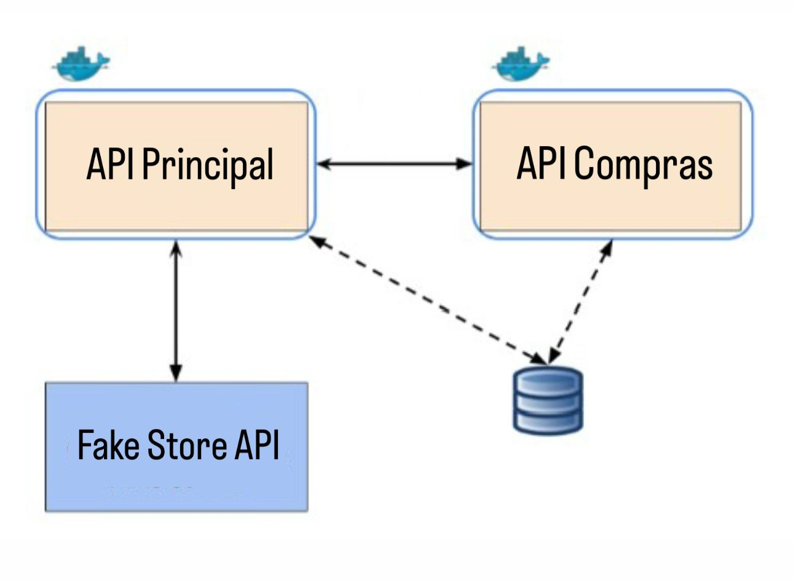

# 🛒 Sistema de Lista de Compras

Este projeto consiste em um sistema de lista de compras desenvolvido com Flask, composto por duas APIs:
- API Principal: Gerencia o catálogo de produtos
- API de Compras: Gerencia a lista de compras do usuário


### Diagrama da Arquitetura


## ✨ Funcionalidades

- 📋 Visualização de produtos disponíveis
- ➕ Adição de produtos à lista de compras
- 🔄 Gerenciamento de quantidades
- 💰 Cálculo automático do valor total
- 🗑️ Limpeza da lista de compras

## 🛠️ Arquitetura

O sistema é composto por duas APIs independentes:

- **API Principal (Porta 5001)**
  - Gerencia o catálogo de produtos
  - Mantém o banco de dados de produtos
  - Fornece endpoints para consulta de produtos

- **API de Compras (Porta 5002)**
  - Gerencia a lista de compras do usuário
  - Processa operações de adição/remoção
  - Calcula valores totais

## 🚀 Tecnologias Utilizadas

- **Backend**
  - Python 3.x
  - Flask
  - SQLAlchemy
  - MySQL
  - Docker
  - Docker Compose

## 🔧 Instalação e Execução

1. Clone o repositório:
```bash
git clone [URL_DO_REPOSITORIO]
```

2. Inicie os containers usando Docker Compose:
```bash
docker-compose up --build
```

3. Acesse as APIs:
- API Principal: http://localhost:5001/api
- API de Compras: http://localhost:5002/api

### Comandos Úteis

```bash
# Parar os containers
docker-compose down

# Reconstruir e reiniciar os containers
docker-compose up --build

# Remover todos os containers e volumes
docker-compose down -v
```

## 📚 Documentação da API externa

### Fake Store API
- Documentação: https://fakestoreapi.com/


### Endpoints Disponíveis

#### API Principal (http://localhost:5001/api)
- `GET /api/list-products-store` - Salva no banco de dados os produtos da API externa
- `GET /api/list-local-products` - Retorna todos os produtos existentes no banco de dados
- `GET /api/get-product/<id>` - Retorna um produto existente no banco de dados
- `POST /api/create-product` - Cria um novo produto no banco de dados
- `PUT /api/update-product/<id>` - Atualiza um produto existente no banco de dados
- `DELETE /api/delete-product/<id>` - Remove um produto existente no banco de dados
- `DELETE /api/delete-all-products` - Remove todos os produtos existentes no banco de dados

#### API de Compras (http://localhost:5002/api)
- `GET /api/list-products-store` - Retorna todos os produtos disponíveis no banco de dados
- `GET /api/product-detail/<id>` - Retorna um produto existente no banco de dados pelo ID
- `GET /api/list-products-shopping-list` - Retorna todos os itens existentes na lista de compras
- `POST /api/add-product-shopping-list` - Adiciona um item à lista de compras
- `DELETE /api/delete-product-shopping-list/<id>` - Remove um item existente da lista de compras
- `GET /api/total-value-shopping-list` - Calcula valor total da lista de compras
- `DELETE /api/clear-shopping-list` - Remove todos os itens existentes na lista de compras

### API Externa Utilizada
- **Fake Store API**
  - Documentação: https://fakestoreapi.com/

## 🛠️ Estrutura do Projeto

```
.
├── api_compras/                # API de gerenciamento de lista de compras
│   ├── app.py                 # Aplicação Flask principal
│   ├── Dockerfile            # Configuração do container Docker
│   ├── requirements.txt      # Dependências Python
│   ├── init.sql             # Script de inicialização do banco de dados
├── api_principal/             # API principal de produtos
│   ├── app.py                # Aplicação Flask principal
│   ├── Dockerfile           # Configuração do container Docker
│   ├── requirements.txt     # Dependências Python
│   ├── init.sql            # Script de inicialização do banco de dados
├── docs/                      # Documentos do projeto
│   ├── images/              # Imagens e diagramas
│   │   └── diagrama.jpeg   # Diagrama da arquitetura
├── docker-compose.yml         # Configuração do ambiente Docker
├── .gitignore                # Arquivos ignorados pelo Git
└── README.md                 # Documentação do projeto
```

## 📞 Suporte

Para suporte, envie um email para [juliakreling14@gmail.com]. 